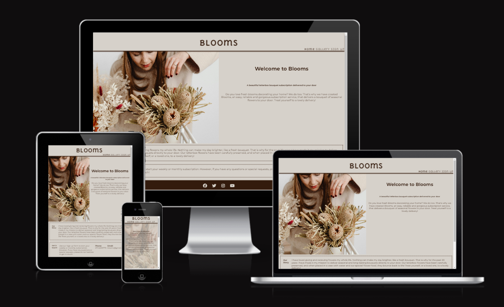
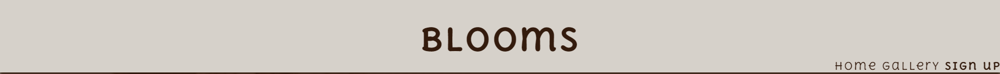
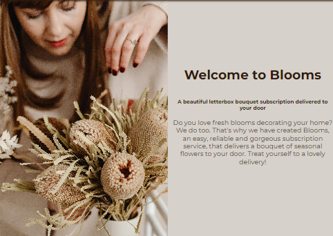
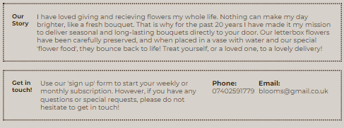
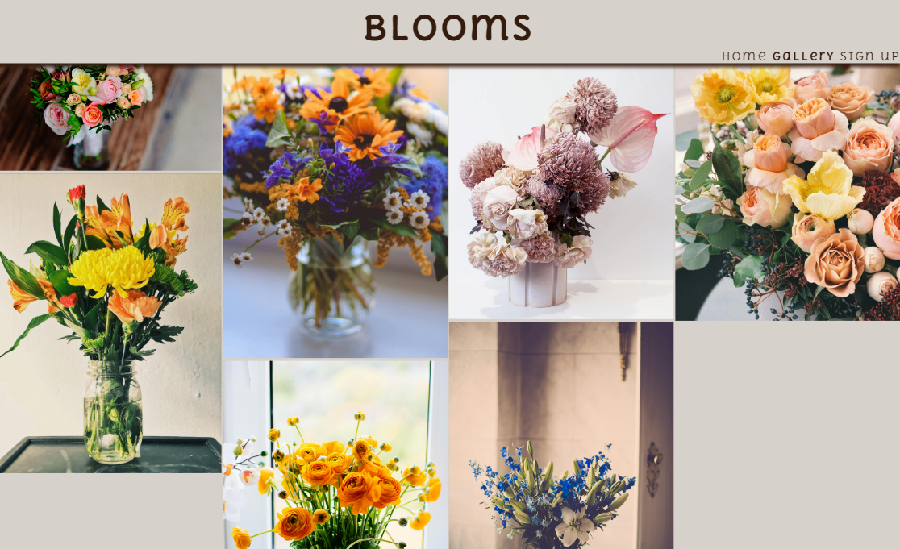
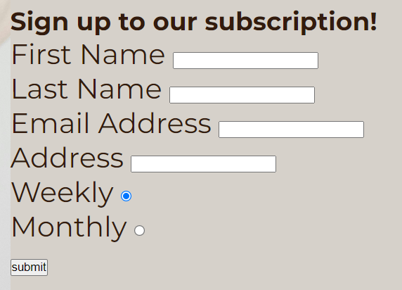
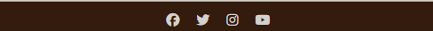
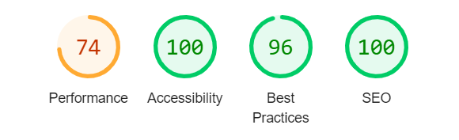

# Blooms
## A bouquet subscription service

The Blooms website is a site designed to attract users who are looking for a regular flower subscription service. Blooms offers users the chance to sign up for a subscription, whilst providing visual reprisentation of what Blooms can provide. 

Blooms is a simple, fully responsive, easy to use and visually attractive website, accessible for anybody to use.

## Features

* Navigation
  * The website features a striking heading of 'Blooms' at the top, which links to the home page.
  * There are three links at the top of the page, 'Home', 'Gallery', and 'Sign up', which link to the relevent page on the site. These are responsive, and appear to the right of the main header for larger screens, and below the header for smaller screens.
  * The navigation features are clear, easy to read and understand and accessible.

* Introduction
  * The introduction features on the home page, and is a clear and visually pleasing short introduction about what the site has to offer. the colours are complimentary and contrast for easy reading. 

* Our story & Contact
  * This section features on the home page and underneath the introduction. This section gives further information about the site and easy to understand contact details. The colour scheme is consistant.

* Gallery
  * Users can navigate to the Gallery, a feature in the site which includes pictures for visual representation of the products on offer. The colour scheme is consistant and the images are organised neatly.

  

* Sign up
  * Users can also navigate to the Sign up page, a clear and easy to understand page where the user can enter their details and sign up to a subscription. 
  * Users have the option to choose between a weekly or monthly subscription. 
  * The sign up form collects the data from the user. It also checks to see if a valid Email address has been written, and that all sections are filled out before completion. 

  

  
  * Footer
    * The footer freatures at the bottom of the site, across all pages in the site. It features four icons representing Facebook, Twitter, Instagram and Youtube, which are external links to the sites. These links open in a seperate tab. 

    

  ## Testing

  * I have tested this site on different browsers including chrome, firefox and safari.
  * I have tested that this site if fully responsive, with a colour scheme and design that is smart, easy to read and understand, and visually pleasing.

### Bugs

* Upon deployment, i discovered that I had used incorrect file paths for some aspects and images on the site. I have been through the file paths in the code and fixed this.

* Unsolved bugs
  * No known unsolved bugs.

### Validator testing

* HTML
  * No errors were returned when passing through the official W3C Validator.
* CSS
  * No errors were returned when passing through the official Jigsaw Validator.
* Accessability
  * I confirmed that the site is accessible using the Lighthouse in dev tools.
  

## Deployment

* The site was deployed to Github Pages. The steps to deploy are as follows:
  * Navigate to the settings button in the Github repository.
  * Select the master branch for the source.
  * The page then provides the link to the deployed website.

  This is a live link to the deployed site: [Blooms](https://maryyoung123.github.io/Blooms/)

## Credits

### Content

The content for this site was influenced by the "Love running" project in Code Institute. The project was frequently referred to to help me with creating this site.

### Media

The Gallery is made up of pictures sourced from [Pexels](https://www.pexels.com/).

I also used a kit from [Font Awesome](https://fontawesome.com/) for icons.